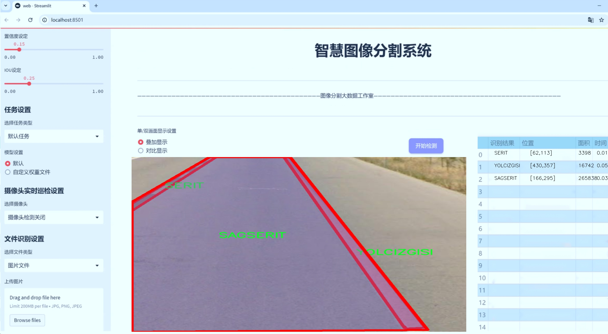

# 道路标线分割系统源码＆数据集分享
 [yolov8-seg-C2f-Parc＆yolov8-seg-SPPF-LSKA等50+全套改进创新点发刊_一键训练教程_Web前端展示]

### 1.研究背景与意义

项目参考[ILSVRC ImageNet Large Scale Visual Recognition Challenge](https://gitee.com/YOLOv8_YOLOv11_Segmentation_Studio/projects)

项目来源[AAAI Global Al lnnovation Contest](https://kdocs.cn/l/cszuIiCKVNis)

研究背景与意义

随着城市化进程的加快，交通管理与安全问题日益凸显。道路标线作为交通管理的重要组成部分，其清晰度和完整性直接影响到交通流畅性和行车安全。然而，传统的道路标线检测与分割方法多依赖人工识别和简单的图像处理技术，效率低下且容易受到环境因素的影响。因此，基于深度学习的自动化道路标线分割系统应运而生，成为提升交通管理智能化水平的重要手段。

YOLO（You Only Look Once）系列模型以其高效的实时目标检测能力，逐渐成为计算机视觉领域的研究热点。YOLOv8作为该系列的最新版本，结合了多种先进的深度学习技术，具备更强的特征提取能力和更快的推理速度。针对道路标线的分割任务，改进YOLOv8模型能够有效提升标线检测的准确性和鲁棒性，尤其是在复杂的道路环境中。通过对YOLOv8的改进，我们可以实现对不同类型道路标线的精准分割，为后续的交通管理和智能驾驶提供可靠的数据支持。

本研究所使用的数据集包含1100幅图像，涵盖了四类道路标线：SAGSERIT、SERIT、SOLSERIT和YOLCIZGISI。这些类别的划分不仅反映了道路标线的多样性，也为模型的训练提供了丰富的样本。通过对这些标线的实例分割，我们能够深入分析不同标线在各种环境下的表现，进而优化模型的训练策略，提高分割精度。此外，数据集的规模和多样性为模型的泛化能力提供了良好的基础，使其能够适应不同的实际应用场景。

研究的意义不仅在于技术层面的创新，更在于其对交通安全和管理的实际贡献。通过构建基于改进YOLOv8的道路标线分割系统，我们能够实现对道路标线的自动检测与监测，及时发现和修复标线损坏问题，从而提升道路安全性。同时，该系统的应用也为智能交通系统的建设提供了重要的数据支持，推动交通管理的智能化和自动化进程。

综上所述，基于改进YOLOv8的道路标线分割系统的研究具有重要的理论价值和现实意义。它不仅推动了计算机视觉技术在交通领域的应用，也为实现更高效的交通管理提供了技术保障。未来，随着深度学习技术的不断发展，我们期待该系统能够在更广泛的交通场景中发挥作用，为智慧城市的建设贡献力量。

### 2.图片演示




##### 注意：由于此博客编辑较早，上面“2.图片演示”和“3.视频演示”展示的系统图片或者视频可能为老版本，新版本在老版本的基础上升级如下：（实际效果以升级的新版本为准）

  （1）适配了YOLOV8的“目标检测”模型和“实例分割”模型，通过加载相应的权重（.pt）文件即可自适应加载模型。

  （2）支持“图片识别”、“视频识别”、“摄像头实时识别”三种识别模式。

  （3）支持“图片识别”、“视频识别”、“摄像头实时识别”三种识别结果保存导出，解决手动导出（容易卡顿出现爆内存）存在的问题，识别完自动保存结果并导出到tempDir中。

  （4）支持Web前端系统中的标题、背景图等自定义修改，后面提供修改教程。

  另外本项目提供训练的数据集和训练教程,暂不提供权重文件（best.pt）,需要您按照教程进行训练后实现图片演示和Web前端界面演示的效果。

### 3.视频演示

[3.1 视频演示](https://www.bilibili.com/video/BV1zW2VYoEKJ/)

### 4.数据集信息展示

##### 4.1 本项目数据集详细数据（类别数＆类别名）

nc: 4
names: ['SAGSERIT', 'SERIT', 'SOLSERIT', 'YOLCIZGISI']


##### 4.2 本项目数据集信息介绍

数据集信息展示

在本研究中，我们使用了名为“model1”的数据集，以支持对YOLOv8-seg模型的训练，旨在改进道路标线的分割系统。该数据集专门针对道路标线的特征进行了精心设计，包含了四个主要类别，分别是“SAGSERIT”、“SERIT”、“SOLSERIT”和“YOLCIZGISI”。这些类别代表了不同类型的道路标线，每种标线在交通管理和安全中扮演着至关重要的角色，因此对其进行准确的分割和识别显得尤为重要。

“SAGSERIT”类别主要涵盖了弯道和曲线道路上的标线，这些标线通常用于指示驾驶者在行驶过程中应遵循的路径。由于其形状和方向的多样性，准确地识别和分割此类标线对于确保道路安全至关重要。数据集中包含的“SAGSERIT”标线图像经过精细标注，确保模型能够学习到其独特的视觉特征，从而在实际应用中实现高效的识别。

“SERIT”类别则专注于直线道路标线，这些标线通常用于分隔车道、指示行驶方向或提供其他交通信息。直线标线的形状相对简单，但在不同的光照条件和天气情况下，其可见性可能会受到影响。因此，数据集中包含了多种环境下的“SERIT”标线图像，以增强模型的鲁棒性，使其能够在各种条件下保持高效的分割性能。

“SOLSERIT”类别则代表了特殊类型的标线，例如人行道边缘线或停车线。这些标线通常具有特定的功能，旨在引导行人和车辆的行为。为了确保模型能够准确识别这些标线，数据集中提供了多样化的场景和角度，帮助模型学习到这些标线在不同情况下的表现特征。

最后，“YOLCIZGISI”类别涵盖了各种复杂的标线组合，通常出现在交叉口或复杂的交通环境中。这些标线的组合形式多样，可能包括多条标线的交错和重叠，因此对模型的分割能力提出了更高的要求。数据集中对“YOLCIZGISI”类别的标注特别注重细节，确保模型能够处理这些复杂的视觉信息。

通过使用“model1”数据集，我们期望在YOLOv8-seg模型的训练过程中，能够有效提升道路标线的分割精度。数据集的多样性和丰富性为模型提供了充分的学习材料，使其能够在实际应用中应对各种复杂的交通场景。此外，针对不同类别的标线，数据集的设计也考虑到了现实世界中标线的变化和不确定性，为模型的泛化能力提供了保障。

综上所述，“model1”数据集不仅在类别数量和标注质量上满足了研究需求，更为YOLOv8-seg模型的训练提供了坚实的基础。通过对该数据集的深入分析和应用，我们希望能够在道路标线分割领域取得显著的进展，为智能交通系统的发展贡献力量。


### 5.全套项目环境部署视频教程（零基础手把手教学）

[5.1 环境部署教程链接（零基础手把手教学）](https://www.bilibili.com/video/BV1jG4Ve4E9t/?vd_source=bc9aec86d164b67a7004b996143742dc)


[5.2 安装Python虚拟环境创建和依赖库安装视频教程链接（零基础手把手教学）](https://www.bilibili.com/video/BV1nA4VeYEze/?vd_source=bc9aec86d164b67a7004b996143742dc)

### 6.手把手YOLOV8-seg训练视频教程（零基础小白有手就能学会）

[6.1 手把手YOLOV8-seg训练视频教程（零基础小白有手就能学会）](https://www.bilibili.com/video/BV1cA4VeYETe/?vd_source=bc9aec86d164b67a7004b996143742dc)


按照上面的训练视频教程链接加载项目提供的数据集，运行train.py即可开始训练



     Epoch   gpu_mem       box       obj       cls    labels  img_size
     1/200     0G   0.01576   0.01955  0.007536        22      1280: 100%|██████████| 849/849 [14:42<00:00,  1.04s/it]
               Class     Images     Labels          P          R     mAP@.5 mAP@.5:.95: 100%|██████████| 213/213 [01:14<00:00,  2.87it/s]
                 all       3395      17314      0.994      0.957      0.0957      0.0843

     Epoch   gpu_mem       box       obj       cls    labels  img_size
     2/200     0G   0.01578   0.01923  0.007006        22      1280: 100%|██████████| 849/849 [14:44<00:00,  1.04s/it]
               Class     Images     Labels          P          R     mAP@.5 mAP@.5:.95: 100%|██████████| 213/213 [01:12<00:00,  2.95it/s]
                 all       3395      17314      0.996      0.956      0.0957      0.0845

     Epoch   gpu_mem       box       obj       cls    labels  img_size
     3/200     0G   0.01561    0.0191  0.006895        27      1280: 100%|██████████| 849/849 [10:56<00:00,  1.29it/s]
               Class     Images     Labels          P          R     mAP@.5 mAP@.5:.95: 100%|███████   | 187/213 [00:52<00:00,  4.04it/s]
                 all       3395      17314      0.996      0.957      0.0957      0.0845


### 7.50+种全套YOLOV8-seg创新点代码加载调参视频教程（一键加载写好的改进模型的配置文件）

[7.1 50+种全套YOLOV8-seg创新点代码加载调参视频教程（一键加载写好的改进模型的配置文件）](https://www.bilibili.com/video/BV1Hw4VePEXv/?vd_source=bc9aec86d164b67a7004b996143742dc)

### 8.YOLOV8-seg图像分割算法原理

原始YOLOV8-seg算法原理

YOLOv8-seg算法是Ultralytics在2023年1月推出的最新目标检测模型，作为YOLO系列的又一重要进展，YOLOv8-seg不仅继承了前几代模型的优点，还在多个方面进行了创新和改进，尤其是在分割任务的处理上，展现出更为卓越的性能。该算法的设计理念是结合了YOLOv5、YOLOv6、YOLOv7以及PP-YOLOE等模型的优点，形成了一种高效、精准且实时的目标检测和分割解决方案。

YOLOv8-seg的网络结构主要由输入层、骨干网络、颈部网络和头部网络四个部分组成。输入层采用了马赛克数据增强、自适应锚框计算和自适应灰度填充等技术，以提高模型的鲁棒性和适应性。骨干网络则引入了C2f模块和SPPF（Spatial Pyramid Pooling Fusion）结构，C2f模块通过更多的分支和跨层连接，增强了特征的表达能力，进而提升了模型对复杂场景的适应性。SPPF结构则通过多尺度特征的融合，进一步增强了网络对不同尺度目标的检测能力。

在颈部网络部分，YOLOv8-seg采用了路径聚合网络（PAN）结构，这一设计使得网络能够更好地融合不同层次的特征，尤其是在处理多尺度目标时，PAN的优势得以充分发挥。通过对浅层特征和深层特征的有效结合，YOLOv8-seg能够在保证检测精度的同时，提升对小目标的检测能力，这在苹果采摘等应用场景中尤为重要。

头部网络是YOLOv8-seg的核心部分，其设计上采用了解耦的分类和回归策略。与以往的耦合头不同，YOLOv8-seg的头部网络将分类和检测过程进行了分离，采用了无锚框（Anchor-Free）检测机制，减少了锚框预测的数量，进而加速了非最大抑制（NMS）过程。这一创新不仅提升了模型的检测速度，也在一定程度上提高了检测精度。损失计算方面，YOLOv8-seg结合了二元交叉熵损失（BCELoss）和分布焦点损失（DFLoss），同时引入了完全交并比损失（CIOULoss），以增强模型对边界框预测的准确性。

在训练过程中，YOLOv8-seg采用了Task-Aligned Assigner策略来进行样本匹配，这一策略通过对分类与回归分数的加权结果进行分析，选择正样本进行训练，从而有效提升了模型的学习效率。此外，YOLOv8-seg在损失函数的设计上也进行了优化，采用了VFLLoss作为分类损失，DFLLoss与CIOULoss的结合则为回归损失提供了更为精准的计算依据。

在实际应用中，YOLOv8-seg展现出了卓越的性能，尤其是在苹果采摘这一特定场景中，能够高效地识别和定位目标，为自动采摘机器人提供了可靠的视觉支持。通过结合蚁群算法进行路径规划，YOLOv8-seg不仅提高了苹果的采摘效率，还为农业自动化提供了新的解决方案。

综上所述，YOLOv8-seg算法通过其创新的网络结构和高效的训练策略，成功地在目标检测和分割领域树立了新的标杆。其在精度、速度和适应性上的显著提升，使得YOLOv8-seg在众多应用场景中，尤其是需要实时反馈和高精度识别的任务中，展现出了强大的竞争力。随着该算法的不断优化和应用推广，未来在智能农业、无人驾驶、安防监控等领域的应用前景将更加广阔。


### 9.系统功能展示（检测对象为举例，实际内容以本项目数据集为准）

图9.1.系统支持检测结果表格显示

  图9.2.系统支持置信度和IOU阈值手动调节

  图9.3.系统支持自定义加载权重文件best.pt(需要你通过步骤5中训练获得)

  图9.4.系统支持摄像头实时识别

  图9.5.系统支持图片识别

  图9.6.系统支持视频识别

  图9.7.系统支持识别结果文件自动保存

  图9.8.系统支持Excel导出检测结果数据


### 10.50+种全套YOLOV8-seg创新点原理讲解（非科班也可以轻松写刊发刊，V11版本正在科研待更新）

#### 10.1 由于篇幅限制，每个创新点的具体原理讲解就不一一展开，具体见下列网址中的创新点对应子项目的技术原理博客网址【Blog】：


[10.1 50+种全套YOLOV8-seg创新点原理讲解链接](https://gitee.com/qunmasj/good)

#### 10.2 部分改进模块原理讲解(完整的改进原理见上图和技术博客链接)【如果此小节的图加载失败可以通过CSDN或者Github搜索该博客的标题访问原始博客，原始博客图片显示正常】
### CBAM空间注意力机制
近年来，随着深度学习研究方向的火热，注意力机制也被广泛地应用在图像识别、语音识别和自然语言处理等领域，注意力机制在深度学习任务中发挥着举足轻重的作用。注意力机制借鉴于人类的视觉系统，例如，人眼在看到一幅画面时，会倾向于关注画面中的重要信息，而忽略其他可见的信息。深度学习中的注意力机制和人类视觉的注意力机制相似，通过扫描全局数据，从大量数据中选择出需要重点关注的、对当前任务更为重要的信息，然后对这部分信息分配更多的注意力资源，从这些信息中获取更多所需要的细节信息，而抑制其他无用的信息。而在深度学习中，则具体表现为给感兴趣的区域更高的权重，经过网络的学习和调整，得到最优的权重分配，形成网络模型的注意力，使网络拥有更强的学习能力，加快网络的收敛速度。
注意力机制通常可分为软注意力机制和硬注意力机制[4-5]。软注意力机制在选择信息时，不是从输入的信息中只选择1个，而会用到所有输入信息，只是各个信息对应的权重分配不同，然后输入网络模型进行计算;硬注意力机制则是从输入的信息中随机选取一个或者选择概率最高的信息，但是这一步骤通常是不可微的，导致硬注意力机制更难训练。因此，软注意力机制应用更为广泛，按照原理可将软注意力机制划分为:通道注意力机制（channel attention)、空间注意力机制(spatial attention）和混合域注意力机制(mixed attention)。
通道注意力机制的本质建立各个特征通道之间的重要程度，对感兴趣的通道进行重点关注，弱化不感兴趣的通道的作用;空间注意力的本质则是建模了整个空间信息的重要程度，然后对空间内感兴趣的区域进行重点关注，弱化其余非感兴趣区域的作用;混合注意力同时运用了通道注意力和空间注意力，两部分先后进行或并行，形成对通道特征和空间特征同时关注的注意力模型。

卷积层注意力模块(Convolutional Block Attention Module，CBAM）是比较常用的混合注意力模块，其先后集中了通道注意力模块和空间注意力模块，网络中加入该模块能有效提高网络性能，减少网络模型的计算量，模块结构如图所示。输入特征图首先经过分支的通道注意力模块，然后和主干的原特征图融合，得到具有通道注意力的特征图，接着经过分支的空间注意力模块，在和主干的特征图融合后，得到同时具有通道特征注意力和空间特征注意力的特征图。CBAM模块不改变输入特征图的大小，因此该模块是一个“即插即用”的模块，可以插入网络的任何位置。

通道注意力模块的结构示意图如图所示，通道注意力模块分支并行地对输入的特征图进行最大池化操作和平均池化操作，然后利用多层感知机对结果进行变换，得到应用于两个通道的变换结果，最后经过sigmoid激活函数将变换结果融合，得到具有通道注意力的通道特征图。

空间注意力模块示意图如图所示，将通道注意力模块输出的特征图作为该模块的输入特征图，首先对输入特征图进行基于通道的最大池化操作和平均池化操作，将两部分得到的结果拼接起来，然后通过卷积得到降为Ⅰ通道的特征图，最后通过sigmoid激活函数生成具有空间注意力的特征图。


### 11.项目核心源码讲解（再也不用担心看不懂代码逻辑）

#### 11.1 ultralytics\utils\callbacks\mlflow.py

以下是经过精简和详细注释的核心代码部分：

```python
# 导入必要的库和模块
from ultralytics.utils import LOGGER, RUNS_DIR, SETTINGS, TESTS_RUNNING, colorstr

try:
    import os
    import mlflow  # 导入MLflow库用于日志记录
    from pathlib import Path

    # 确保不在测试环境中记录日志
    assert not TESTS_RUNNING or 'test_mlflow' in os.environ.get('PYTEST_CURRENT_TEST', '')
    # 确保MLflow集成已启用
    assert SETTINGS['mlflow'] is True  
    assert hasattr(mlflow, '__version__')  # 确保mlflow包已正确导入

    PREFIX = colorstr('MLflow: ')  # 设置日志前缀

except (ImportError, AssertionError):
    mlflow = None  # 如果导入失败，则将mlflow设置为None


def on_pretrain_routine_end(trainer):
    """
    在预训练例程结束时记录训练参数到MLflow。

    Args:
        trainer (ultralytics.engine.trainer.BaseTrainer): 训练对象，包含要记录的参数。

    Global:
        mlflow: 导入的mlflow模块，用于记录日志。

    Environment Variables:
        MLFLOW_TRACKING_URI: MLflow跟踪的URI。如果未设置，默认为'runs/mlflow'。
        MLFLOW_EXPERIMENT_NAME: MLflow实验的名称。如果未设置，默认为trainer.args.project。
        MLFLOW_RUN: MLflow运行的名称。如果未设置，默认为trainer.args.name。
    """
    global mlflow

    # 获取跟踪URI，默认为'runs/mlflow'
    uri = os.environ.get('MLFLOW_TRACKING_URI') or str(RUNS_DIR / 'mlflow')
    LOGGER.debug(f'{PREFIX} tracking uri: {uri}')
    mlflow.set_tracking_uri(uri)  # 设置MLflow跟踪URI

    # 设置实验和运行名称
    experiment_name = os.environ.get('MLFLOW_EXPERIMENT_NAME') or trainer.args.project or '/Shared/YOLOv8'
    run_name = os.environ.get('MLFLOW_RUN') or trainer.args.name
    mlflow.set_experiment(experiment_name)  # 设置实验名称

    mlflow.autolog()  # 启用自动日志记录
    try:
        # 开始MLflow运行
        active_run = mlflow.active_run() or mlflow.start_run(run_name=run_name)
        LOGGER.info(f'{PREFIX}logging run_id({active_run.info.run_id}) to {uri}')
        if Path(uri).is_dir():
            LOGGER.info(f"{PREFIX}view at http://127.0.0.1:5000 with 'mlflow server --backend-store-uri {uri}'")
        LOGGER.info(f"{PREFIX}disable with 'yolo settings mlflow=False'")
        mlflow.log_params(dict(trainer.args))  # 记录训练参数
    except Exception as e:
        LOGGER.warning(f'{PREFIX}WARNING ⚠️ Failed to initialize: {e}\n'
                       f'{PREFIX}WARNING ⚠️ Not tracking this run')


def on_fit_epoch_end(trainer):
    """在每个训练周期结束时记录训练指标到MLflow。"""
    if mlflow:
        # 清理指标名称并记录到MLflow
        sanitized_metrics = {k.replace('(', '').replace(')', ''): float(v) for k, v in trainer.metrics.items()}
        mlflow.log_metrics(metrics=sanitized_metrics, step=trainer.epoch)


def on_train_end(trainer):
    """在训练结束时记录模型工件。"""
    if mlflow:
        # 记录最佳模型的目录
        mlflow.log_artifact(str(trainer.best.parent))  
        # 记录保存目录中的所有其他文件
        for f in trainer.save_dir.glob('*'):
            if f.suffix in {'.png', '.jpg', '.csv', '.pt', '.yaml'}:
                mlflow.log_artifact(str(f))

        mlflow.end_run()  # 结束MLflow运行
        LOGGER.info(f'{PREFIX}results logged to {mlflow.get_tracking_uri()}\n'
                    f"{PREFIX}disable with 'yolo settings mlflow=False'")


# 定义回调函数
callbacks = {
    'on_pretrain_routine_end': on_pretrain_routine_end,
    'on_fit_epoch_end': on_fit_epoch_end,
    'on_train_end': on_train_end} if mlflow else {}
```

### 代码分析：
1. **导入模块**：首先导入了必要的模块，包括`mlflow`用于日志记录和`os`用于环境变量的管理。
2. **异常处理**：通过`try-except`块确保在导入`mlflow`时处理可能的错误。
3. **函数`on_pretrain_routine_end`**：在预训练结束时设置MLflow的跟踪URI、实验名称和运行名称，并记录训练参数。
4. **函数`on_fit_epoch_end`**：在每个训练周期结束时记录当前的训练指标。
5. **函数`on_train_end`**：在训练结束时记录模型的工件（如权重文件和其他相关文件）。
6. **回调字典**：根据是否成功导入`mlflow`来定义回调函数。

这段代码的核心功能是通过MLflow记录训练过程中的各种参数和指标，以便后续分析和可视化。

这个文件是Ultralytics YOLO项目中的一个模块，主要用于集成MLflow进行模型训练过程中的日志记录。MLflow是一个开源平台，用于管理机器学习的生命周期，包括实验跟踪、模型管理和部署等功能。该模块的功能包括记录训练参数、训练指标和模型工件等。

文件开头的文档字符串详细说明了如何设置和使用MLflow，包括如何指定项目名称、运行名称、启动本地MLflow服务器以及如何终止正在运行的MLflow服务器实例。这些命令可以通过环境变量或命令行参数进行设置。

接下来，文件导入了一些必要的模块和库，包括Ultralytics的日志记录工具、运行目录、设置和颜色字符串。它还尝试导入os模块，并进行了一些断言检查，以确保在特定条件下（如不是在运行pytest测试时）进行MLflow的日志记录。此外，它还检查MLflow库是否已正确导入。

`on_pretrain_routine_end`函数在预训练过程结束时被调用，用于记录训练参数。它首先设置MLflow的跟踪URI、实验名称和运行名称，然后启动MLflow运行并记录训练参数。该函数使用环境变量来获取这些信息，如果没有设置环境变量，则使用默认值。函数内部还包含了异常处理，以防初始化失败时给出警告。

`on_fit_epoch_end`函数在每个训练周期结束时被调用，用于记录训练指标。它将训练指标进行清洗（去掉括号并转换为浮点数），然后将这些指标记录到MLflow中。

`on_train_end`函数在训练结束时被调用，用于记录模型工件。它会记录最佳模型的目录及其他保存的文件（如图像、CSV、模型权重等），并结束当前的MLflow运行。记录完成后，函数会输出日志信息，指示结果已成功记录。

最后，文件定义了一个回调字典，将上述三个函数与相应的事件关联起来，仅在MLflow可用时才会进行设置。这种设计使得代码在没有MLflow的情况下也能正常运行，而不会引发错误。

#### 11.2 ui.py

```python
import sys
import subprocess

def run_script(script_path):
    """
    使用当前 Python 环境运行指定的脚本。

    Args:
        script_path (str): 要运行的脚本路径

    Returns:
        None
    """
    # 获取当前 Python 解释器的路径
    python_path = sys.executable

    # 构建运行命令，使用 streamlit 运行指定的脚本
    command = f'"{python_path}" -m streamlit run "{script_path}"'

    # 执行命令
    result = subprocess.run(command, shell=True)
    # 检查命令执行结果，如果返回码不为0，则表示出错
    if result.returncode != 0:
        print("脚本运行出错。")

# 主程序入口
if __name__ == "__main__":
    # 指定要运行的脚本路径
    script_path = "web.py"  # 这里可以直接指定脚本路径

    # 调用函数运行脚本
    run_script(script_path)
```

### 代码核心部分及注释说明：

1. **导入模块**：
   - `import sys`: 导入系统相关的模块，用于获取当前 Python 解释器的路径。
   - `import subprocess`: 导入子进程模块，用于执行外部命令。

2. **`run_script` 函数**：
   - 定义一个函数 `run_script`，接受一个参数 `script_path`，表示要运行的脚本路径。
   - 使用 `sys.executable` 获取当前 Python 解释器的路径，以便在正确的环境中运行脚本。
   - 构建一个命令字符串，使用 `streamlit` 运行指定的脚本。
   - 使用 `subprocess.run` 执行构建的命令，并通过 `shell=True` 允许在 shell 中执行。
   - 检查命令的返回码，如果返回码不为0，打印错误信息。

3. **主程序入口**：
   - 使用 `if __name__ == "__main__":` 确保代码块仅在直接运行时执行。
   - 指定要运行的脚本路径（这里为 `"web.py"`）。
   - 调用 `run_script` 函数来执行指定的脚本。

这个程序文件名为 `ui.py`，主要功能是使用当前的 Python 环境来运行一个指定的脚本。程序首先导入了必要的模块，包括 `sys`、`os` 和 `subprocess`，以及一个自定义的模块 `QtFusion.path` 中的 `abs_path` 函数。

在程序中定义了一个名为 `run_script` 的函数，该函数接受一个参数 `script_path`，表示要运行的脚本的路径。函数内部首先获取当前 Python 解释器的路径，并将其存储在 `python_path` 变量中。接着，构建一个命令字符串，使用 `streamlit` 来运行指定的脚本。这个命令通过 `subprocess.run` 函数执行，并设置 `shell=True` 以便在 shell 中运行该命令。

在执行命令后，程序检查返回的结果码。如果返回码不为零，表示脚本运行出错，程序会打印出“脚本运行出错。”的提示信息。

最后，在 `if __name__ == "__main__":` 语句块中，程序指定了要运行的脚本路径，这里使用了 `abs_path` 函数来获取 `web.py` 的绝对路径。然后调用 `run_script` 函数来执行这个脚本。

总体来看，这个程序的主要目的是提供一个简单的接口来运行指定的 Python 脚本，特别是与 `streamlit` 相关的脚本，便于用户在当前的 Python 环境中进行测试或开发。

#### 11.3 ultralytics\data\dataset.py

以下是代码中最核心的部分，并附上详细的中文注释：

```python
import numpy as np
import torch
from pathlib import Path
from ultralytics.utils import TQDM, LOGGER, get_hash, img2label_paths, verify_image_label

# Ultralytics 数据集缓存版本，>= 1.0.0 用于 YOLOv8
DATASET_CACHE_VERSION = '1.0.3'

class YOLODataset:
    """
    YOLO 数据集类，用于加载 YOLO 格式的目标检测和/或分割标签。

    参数:
        data (dict, optional): 数据集的 YAML 字典。默认为 None。
        use_segments (bool, optional): 如果为 True，则使用分割掩码作为标签。默认为 False。
        use_keypoints (bool, optional): 如果为 True，则使用关键点作为标签。默认为 False。
    """

    def __init__(self, data=None, use_segments=False, use_keypoints=False):
        """初始化 YOLODataset，配置分割和关键点的选项。"""
        self.use_segments = use_segments
        self.use_keypoints = use_keypoints
        self.data = data
        assert not (self.use_segments and self.use_keypoints), '不能同时使用分割和关键点。'

    def cache_labels(self, path=Path('./labels.cache')):
        """
        缓存数据集标签，检查图像并读取形状。

        参数:
            path (Path): 保存缓存文件的路径（默认: Path('./labels.cache')）。
        返回:
            (dict): 标签字典。
        """
        x = {'labels': []}  # 初始化标签字典
        nm, nf, ne, nc, msgs = 0, 0, 0, 0, []  # 统计缺失、找到、空、损坏的图像数量
        total = len(self.im_files)  # 图像文件总数
        nkpt, ndim = self.data.get('kpt_shape', (0, 0))  # 获取关键点形状

        # 使用多线程验证图像和标签
        with ThreadPool(NUM_THREADS) as pool:
            results = pool.imap(func=verify_image_label,
                                iterable=zip(self.im_files, self.label_files))
            pbar = TQDM(results, desc='扫描中...', total=total)  # 进度条
            for im_file, lb, shape, segments, keypoint, nm_f, nf_f, ne_f, nc_f, msg in pbar:
                nm += nm_f
                nf += nf_f
                ne += ne_f
                nc += nc_f
                if im_file:
                    x['labels'].append(
                        dict(
                            im_file=im_file,
                            shape=shape,
                            cls=lb[:, 0:1],  # 类别
                            bboxes=lb[:, 1:],  # 边界框
                            segments=segments,
                            keypoints=keypoint,
                            normalized=True,
                            bbox_format='xywh'))  # 边界框格式
                if msg:
                    msgs.append(msg)
                pbar.desc = f'扫描中... {nf} 图像, {nm + ne} 背景, {nc} 损坏'
            pbar.close()

        if msgs:
            LOGGER.info('\n'.join(msgs))  # 记录警告信息
        x['hash'] = get_hash(self.label_files + self.im_files)  # 计算哈希值
        save_dataset_cache_file(self.prefix, path, x)  # 保存缓存文件
        return x

    def get_labels(self):
        """返回 YOLO 训练的标签字典。"""
        self.label_files = img2label_paths(self.im_files)  # 获取标签文件路径
        cache_path = Path(self.label_files[0]).parent.with_suffix('.cache')  # 缓存文件路径
        try:
            cache, exists = load_dataset_cache_file(cache_path), True  # 尝试加载缓存文件
            assert cache['version'] == DATASET_CACHE_VERSION  # 检查版本
            assert cache['hash'] == get_hash(self.label_files + self.im_files)  # 检查哈希值
        except (FileNotFoundError, AssertionError):
            cache, exists = self.cache_labels(cache_path), False  # 运行缓存操作

        # 读取缓存
        labels = cache['labels']
        if not labels:
            LOGGER.warning(f'警告 ⚠️ 在 {cache_path} 中未找到图像，训练可能无法正常工作。')
        self.im_files = [lb['im_file'] for lb in labels]  # 更新图像文件列表
        return labels

    @staticmethod
    def collate_fn(batch):
        """将数据样本合并为批次。"""
        new_batch = {}
        keys = batch[0].keys()
        values = list(zip(*[list(b.values()) for b in batch]))
        for i, k in enumerate(keys):
            value = values[i]
            if k == 'img':
                value = torch.stack(value, 0)  # 将图像堆叠
            if k in ['masks', 'keypoints', 'bboxes', 'cls']:
                value = torch.cat(value, 0)  # 将掩码、关键点、边界框和类别合并
            new_batch[k] = value
        return new_batch

def load_dataset_cache_file(path):
    """从路径加载 Ultralytics *.cache 字典。"""
    cache = np.load(str(path), allow_pickle=True).item()  # 加载字典
    return cache

def save_dataset_cache_file(prefix, path, x):
    """将 Ultralytics 数据集 *.cache 字典 x 保存到路径。"""
    x['version'] = DATASET_CACHE_VERSION  # 添加缓存版本
    if path.exists():
        path.unlink()  # 如果存在，删除缓存文件
    np.save(str(path), x)  # 保存缓存
    LOGGER.info(f'{prefix}新缓存已创建: {path}')  # 记录缓存创建信息
```

### 代码核心部分说明：
1. **YOLODataset 类**：这是一个用于加载 YOLO 格式数据集的类，支持目标检测和分割任务。
2. **cache_labels 方法**：该方法用于缓存数据集标签，检查图像的有效性，并记录相关信息。
3. **get_labels 方法**：该方法返回用于训练的标签字典，支持从缓存中加载标签。
4. **collate_fn 方法**：用于将多个样本合并为一个批次，方便模型训练。
5. **load_dataset_cache_file 和 save_dataset_cache_file 方法**：用于加载和保存数据集的缓存文件，提升数据加载效率。

这个程序文件主要定义了用于YOLO（You Only Look Once）模型的两个数据集类：`YOLODataset`和`ClassificationDataset`，以及一些辅助函数。以下是对代码的详细说明。

首先，文件导入了一些必要的库，包括`contextlib`、`itertools`、`multiprocessing`、`pathlib`、`cv2`、`numpy`、`torch`和`torchvision`，以及一些来自`ultralytics`的工具函数和类。`DATASET_CACHE_VERSION`定义了数据集缓存的版本号。

`YOLODataset`类继承自`BaseDataset`，用于加载YOLO格式的目标检测和分割标签。它的构造函数接收一些参数，包括数据字典、是否使用分割掩码和关键点。类中有多个方法，主要功能包括：

- `cache_labels`：缓存数据集标签，检查图像并读取形状。它会遍历图像文件和标签文件，验证它们的有效性，并将结果存储在缓存文件中。
- `get_labels`：返回YOLO训练所需的标签字典。它尝试加载缓存文件，如果缓存文件不存在或不匹配，则调用`cache_labels`方法生成新的缓存。
- `build_transforms`：构建并返回数据增强的转换操作。
- `close_mosaic`：关闭马赛克增强选项并构建转换。
- `update_labels_info`：自定义标签格式，将边界框、分割和关键点信息整合到一个实例中。
- `collate_fn`：将数据样本合并成批次，适用于PyTorch的数据加载。

`ClassificationDataset`类继承自`torchvision.datasets.ImageFolder`，用于处理YOLO分类数据集。它的构造函数接收数据集路径、参数设置、增强选项和缓存设置。主要方法包括：

- `__getitem__`：根据给定索引返回数据和目标的子集。
- `__len__`：返回数据集中样本的总数。
- `verify_images`：验证数据集中所有图像的有效性，并生成缓存文件。

此外，文件还定义了两个辅助函数：`load_dataset_cache_file`和`save_dataset_cache_file`，用于加载和保存数据集的缓存文件。

最后，文件中还有一个占位符类`SemanticDataset`，用于语义分割数据集，目前尚未实现具体功能。

整体来看，这个文件为YOLO模型的训练提供了数据集的加载、验证和缓存功能，确保在训练过程中能够高效地处理数据。

#### 11.4 train.py

以下是代码中最核心的部分，并附上详细的中文注释：

```python
import os
import torch
import yaml
from ultralytics import YOLO  # 导入YOLO模型库

if __name__ == '__main__':  # 确保该模块被直接运行时才执行以下代码
    # 设置训练参数
    workers = 1  # 数据加载的工作进程数
    batch = 8  # 每个批次的样本数量，需根据显存大小调整
    device = "0" if torch.cuda.is_available() else "cpu"  # 判断是否使用GPU

    # 获取数据集配置文件的绝对路径
    data_path = abs_path(f'datasets/data/data.yaml', path_type='current')

    # 将路径格式转换为Unix风格
    unix_style_path = data_path.replace(os.sep, '/')
    # 获取数据集所在目录的路径
    directory_path = os.path.dirname(unix_style_path)

    # 读取YAML文件，保持原有顺序
    with open(data_path, 'r') as file:
        data = yaml.load(file, Loader=yaml.FullLoader)

    # 修改YAML文件中的训练、验证和测试数据路径
    if 'train' in data and 'val' in data and 'test' in data:
        data['train'] = directory_path + '/train'  # 设置训练数据路径
        data['val'] = directory_path + '/val'      # 设置验证数据路径
        data['test'] = directory_path + '/test'    # 设置测试数据路径

        # 将修改后的数据写回YAML文件
        with open(data_path, 'w') as file:
            yaml.safe_dump(data, file, sort_keys=False)

    # 加载YOLO模型，指定配置文件和预训练权重
    model = YOLO(r"C:\codeseg\codenew\50+种YOLOv8算法改进源码大全和调试加载训练教程（非必要）\改进YOLOv8模型配置文件\yolov8-seg-C2f-Faster.yaml").load("./weights/yolov8s-seg.pt")

    # 开始训练模型
    results = model.train(
        data=data_path,  # 指定训练数据的配置文件路径
        device=device,    # 指定使用的设备（GPU或CPU）
        workers=workers,  # 指定数据加载的工作进程数
        imgsz=640,        # 指定输入图像的大小为640x640
        epochs=100,       # 指定训练的轮数为100
        batch=batch,      # 指定每个批次的样本数量
    )
```

### 代码核心部分解释：
1. **导入必要的库**：导入了处理文件路径、深度学习框架（PyTorch）、YAML文件解析和YOLO模型的库。
2. **设置训练参数**：包括工作进程数、批次大小和设备选择（GPU或CPU）。
3. **读取和修改YAML配置文件**：读取数据集配置文件，修改其中的训练、验证和测试数据路径，以确保路径正确。
4. **加载YOLO模型**：根据指定的配置文件和预训练权重加载YOLO模型。
5. **训练模型**：调用模型的训练方法，传入必要的参数以开始训练过程。

这个程序文件`train.py`的主要功能是使用YOLO（You Only Look Once）模型进行目标检测的训练。以下是对代码的逐行讲解。

首先，程序导入了一些必要的库，包括`os`、`torch`、`yaml`、`ultralytics`中的YOLO模型、路径处理工具`abs_path`以及用于绘图的`matplotlib`。其中，`matplotlib.use('TkAgg')`用于设置图形后端。

在`if __name__ == '__main__':`语句下，确保只有当该文件被直接运行时，以下代码才会执行。接着，定义了一些训练参数，包括`workers`（数据加载的工作进程数）、`batch`（每个批次的样本数，默认为8）以及`device`（选择使用GPU还是CPU进行训练）。

然后，程序通过`abs_path`函数获取数据集配置文件`data.yaml`的绝对路径，并将路径中的分隔符统一为Unix风格的斜杠。接着，利用`os.path.dirname`获取该路径的目录部分。

程序接下来打开`data.yaml`文件并读取其内容，使用`yaml.load`方法保持原有的顺序。读取后，检查YAML文件中是否包含`train`、`val`和`test`这三个字段。如果存在，程序将这些字段的值修改为对应的训练、验证和测试数据集的路径，并将修改后的内容写回到YAML文件中。

在这之后，程序加载YOLO模型的配置文件和预训练权重。这里的模型配置文件路径是一个具体的文件路径，程序会根据该配置文件加载相应的YOLO模型。

最后，程序调用`model.train`方法开始训练模型。训练时指定了数据配置文件的路径、设备类型、工作进程数、输入图像的大小（640x640）、训练的轮数（100个epoch）以及每个批次的大小（8）。

总体而言，这段代码的主要流程是设置训练参数、准备数据集、加载YOLO模型，并最终开始训练过程。

#### 11.5 ultralytics\data\augment.py

以下是代码中最核心的部分，并附上详细的中文注释：

```python
class BaseTransform:
    """
    图像变换的基类。

    这是一个通用的变换类，可以扩展以满足特定的图像处理需求。
    该类旨在与分类和语义分割任务兼容。

    方法：
        __init__: 初始化 BaseTransform 对象。
        apply_image: 对标签应用图像变换。
        apply_instances: 对标签中的对象实例应用变换。
        apply_semantic: 对图像应用语义分割。
        __call__: 对图像、实例和语义掩码应用所有标签变换。
    """

    def __init__(self) -> None:
        """初始化 BaseTransform 对象。"""
        pass

    def apply_image(self, labels):
        """对标签应用图像变换。"""
        pass

    def apply_instances(self, labels):
        """对标签中的对象实例应用变换。"""
        pass

    def apply_semantic(self, labels):
        """对图像应用语义分割。"""
        pass

    def __call__(self, labels):
        """对图像、实例和语义掩码应用所有标签变换。"""
        self.apply_image(labels)
        self.apply_instances(labels)
        self.apply_semantic(labels)


class Compose:
    """组合多个图像变换的类。"""

    def __init__(self, transforms):
        """用变换列表初始化 Compose 对象。"""
        self.transforms = transforms

    def __call__(self, data):
        """对输入数据应用一系列变换。"""
        for t in self.transforms:
            data = t(data)
        return data


class Mosaic(BaseMixTransform):
    """
    马赛克增强。

    该类通过将多个（4 或 9）图像组合成一个马赛克图像来执行马赛克增强。
    增强以给定的概率应用于数据集。

    属性：
        dataset: 应用马赛克增强的数据集。
        imgsz (int, optional): 单个图像的马赛克管道后的图像大小（高度和宽度）。默认为 640。
        p (float, optional): 应用马赛克增强的概率。必须在 0-1 范围内。默认为 1.0。
        n (int, optional): 网格大小，4（2x2）或 9（3x3）。
    """

    def __init__(self, dataset, imgsz=640, p=1.0, n=4):
        """用数据集、图像大小、概率和边界初始化对象。"""
        assert 0 <= p <= 1.0, f'概率应在 [0, 1] 范围内，但得到 {p}。'
        assert n in (4, 9), '网格必须等于 4 或 9。'
        super().__init__(dataset=dataset, p=p)
        self.dataset = dataset
        self.imgsz = imgsz
        self.border = (-imgsz // 2, -imgsz // 2)  # 宽度，高度
        self.n = n

    def get_indexes(self, buffer=True):
        """返回数据集中随机索引的列表。"""
        if buffer:  # 从缓冲区选择图像
            return random.choices(list(self.dataset.buffer), k=self.n - 1)
        else:  # 选择任何图像
            return [random.randint(0, len(self.dataset) - 1) for _ in range(self.n - 1)]

    def _mix_transform(self, labels):
        """对标签字典应用 MixUp 或 Mosaic 增强。"""
        assert labels.get('rect_shape', None) is None, 'rect 和 mosaic 是互斥的。'
        assert len(labels.get('mix_labels', [])), '没有其他图像用于马赛克增强。'
        return self._mosaic4(labels) if self.n == 4 else self._mosaic9(labels)

    def _mosaic4(self, labels):
        """创建 2x2 图像马赛克。"""
        mosaic_labels = []
        s = self.imgsz
        yc, xc = (int(random.uniform(-x, 2 * s + x)) for x in self.border)  # 马赛克中心 x, y
        for i in range(4):
            labels_patch = labels if i == 0 else labels['mix_labels'][i - 1]
            img = labels_patch['img']
            h, w = labels_patch.pop('resized_shape')

            # 将图像放置在 img4 中
            if i == 0:  # 左上角
                img4 = np.full((s * 2, s * 2, img.shape[2]), 114, dtype=np.uint8)  # 用 4 个图块的基础图像
                x1a, y1a, x2a, y2a = max(xc - w, 0), max(yc - h, 0), xc, yc  # xmin, ymin, xmax, ymax（大图像）
                x1b, y1b, x2b, y2b = w - (x2a - x1a), h - (y2a - y1a), w, h  # xmin, ymin, xmax, ymax（小图像）
            # 其他位置的处理类似...

            img4[y1a:y2a, x1a:x2a] = img[y1b:y2b, x1b:x2b]  # img4[ymin:ymax, xmin:xmax]
            padw = x1a - x1b
            padh = y1a - y1b

            labels_patch = self._update_labels(labels_patch, padw, padh)
            mosaic_labels.append(labels_patch)
        final_labels = self._cat_labels(mosaic_labels)
        final_labels['img'] = img4
        return final_labels

    # 其他方法和类的实现...
```

以上代码片段展示了图像变换的基本结构，包括 `BaseTransform` 类、`Compose` 类和 `Mosaic` 类。每个类都有详细的中文注释，解释了其功能和方法。

这个程序文件 `ultralytics\data\augment.py` 是用于图像增强的模块，主要应用于计算机视觉任务，特别是目标检测和图像分类。文件中定义了多个类和方法，用于实现不同的图像增强技术。

首先，文件导入了一些必要的库，包括数学运算、随机数生成、图像处理库（如 OpenCV 和 NumPy）、深度学习框架（如 PyTorch 和 torchvision）等。接着，定义了一个基类 `BaseTransform`，该类为图像转换提供了基本框架，包括初始化、应用图像转换、应用实例转换、应用语义分割等方法。

`Compose` 类用于将多个图像转换组合在一起，允许用户按顺序应用一系列转换。用户可以通过 `append` 方法添加新的转换，并通过 `tolist` 方法将转换列表转换为标准 Python 列表。

`BaseMixTransform` 类是一个基类，用于实现混合增强（如 MixUp 和 Mosaic）。它包含了对数据集的引用、预处理转换和应用增强的概率。在其子类中，`Mosaic` 类实现了马赛克增强，通过将多个图像组合成一个马赛克图像来增强数据集。该类允许用户指定图像大小、应用概率和网格大小（4 或 9）。

`MixUp` 类则实现了 MixUp 增强，通过将两张图像混合在一起，生成新的图像和标签。

`RandomPerspective` 类实现了随机透视变换，允许对图像进行旋转、平移、缩放和剪切等变换，同时更新对应的边界框、分割和关键点。

`RandomHSV` 类用于随机调整图像的色调、饱和度和亮度，以增加图像的多样性。`RandomFlip` 类则实现了随机翻转图像的功能，可以进行水平或垂直翻转，并相应地更新实例的边界框和关键点。

`LetterBox` 类用于调整图像大小并进行填充，以适应目标检测和实例分割的要求。`CopyPaste` 类实现了图像的复制粘贴增强，通过将一个图像的实例复制到另一个图像上来增加数据集的多样性。

`Albumentations` 类提供了一系列增强方法，使用 `albumentations` 库来实现模糊、对比度调整、随机亮度和图像压缩等。

最后，`Format` 类用于格式化图像注释，以便在 PyTorch 的 DataLoader 中使用。它将图像、类标签和边界框标准化，并根据需要返回掩码和关键点。

文件还定义了一些特定的转换函数，如 `v8_transforms` 和 `classify_transforms`，用于将图像转换为适合 YOLOv8 训练的格式。

总体而言，这个文件提供了丰富的图像增强功能，旨在提高模型的泛化能力和鲁棒性，适用于各种计算机视觉任务。

#### 11.6 ultralytics\models\sam\build.py

以下是代码中最核心的部分，并附上详细的中文注释：

```python
import torch
from functools import partial

from ultralytics.utils.downloads import attempt_download_asset
from .modules.decoders import MaskDecoder
from .modules.encoders import ImageEncoderViT, PromptEncoder
from .modules.sam import Sam
from .modules.tiny_encoder import TinyViT
from .modules.transformer import TwoWayTransformer

def _build_sam(encoder_embed_dim,
               encoder_depth,
               encoder_num_heads,
               encoder_global_attn_indexes,
               checkpoint=None,
               mobile_sam=False):
    """构建选定的SAM模型架构。"""
    
    # 定义提示嵌入维度和图像大小
    prompt_embed_dim = 256
    image_size = 1024
    vit_patch_size = 16
    image_embedding_size = image_size // vit_patch_size  # 计算图像嵌入大小

    # 根据是否为移动版本选择不同的图像编码器
    image_encoder = (TinyViT(
        img_size=1024,
        in_chans=3,
        num_classes=1000,
        embed_dims=encoder_embed_dim,
        depths=encoder_depth,
        num_heads=encoder_num_heads,
        window_sizes=[7, 7, 14, 7],
        mlp_ratio=4.0,
        drop_rate=0.0,
        drop_path_rate=0.0,
        use_checkpoint=False,
        mbconv_expand_ratio=4.0,
        local_conv_size=3,
        layer_lr_decay=0.8,
    ) if mobile_sam else ImageEncoderViT(
        depth=encoder_depth,
        embed_dim=encoder_embed_dim,
        img_size=image_size,
        mlp_ratio=4,
        norm_layer=partial(torch.nn.LayerNorm, eps=1e-6),
        num_heads=encoder_num_heads,
        patch_size=vit_patch_size,
        qkv_bias=True,
        use_rel_pos=True,
        global_attn_indexes=encoder_global_attn_indexes,
        window_size=14,
        out_chans=prompt_embed_dim,
    ))

    # 创建SAM模型
    sam = Sam(
        image_encoder=image_encoder,  # 图像编码器
        prompt_encoder=PromptEncoder(
            embed_dim=prompt_embed_dim,
            image_embedding_size=(image_embedding_size, image_embedding_size),
            input_image_size=(image_size, image_size),
            mask_in_chans=16,
        ),
        mask_decoder=MaskDecoder(
            num_multimask_outputs=3,
            transformer=TwoWayTransformer(
                depth=2,
                embedding_dim=prompt_embed_dim,
                mlp_dim=2048,
                num_heads=8,
            ),
            transformer_dim=prompt_embed_dim,
            iou_head_depth=3,
            iou_head_hidden_dim=256,
        ),
        pixel_mean=[123.675, 116.28, 103.53],  # 图像像素均值
        pixel_std=[58.395, 57.12, 57.375],      # 图像像素标准差
    )

    # 如果提供了检查点，则加载模型权重
    if checkpoint is not None:
        checkpoint = attempt_download_asset(checkpoint)  # 尝试下载检查点
        with open(checkpoint, 'rb') as f:
            state_dict = torch.load(f)  # 加载权重
        sam.load_state_dict(state_dict)  # 将权重加载到模型中

    sam.eval()  # 设置模型为评估模式
    return sam  # 返回构建的SAM模型

def build_sam(ckpt='sam_b.pt'):
    """根据指定的检查点构建SAM模型。"""
    model_builder = None
    ckpt = str(ckpt)  # 将检查点转换为字符串，以支持Path类型
    for k in sam_model_map.keys():
        if ckpt.endswith(k):
            model_builder = sam_model_map.get(k)  # 获取对应的模型构建函数

    if not model_builder:
        raise FileNotFoundError(f'{ckpt} 不是一个支持的SAM模型。可用模型有: \n {sam_model_map.keys()}')

    return model_builder(ckpt)  # 调用模型构建函数并返回模型
```

### 代码说明：
1. **导入模块**：导入必要的库和模块，包括PyTorch和自定义的模块。
2. **`_build_sam`函数**：该函数负责构建SAM模型，接受多个参数来配置模型的结构，包括编码器的嵌入维度、深度、头数等。
3. **图像编码器选择**：根据是否是移动版本选择不同的图像编码器（`TinyViT`或`ImageEncoderViT`）。
4. **SAM模型构建**：创建`Sam`对象，包含图像编码器、提示编码器和掩码解码器。
5. **加载检查点**：如果提供了检查点路径，则尝试下载并加载模型权重。
6. **评估模式**：将模型设置为评估模式，以便在推理时使用。
7. **`build_sam`函数**：根据指定的检查点构建相应的SAM模型，并返回构建的模型。

这个程序文件是用于构建和返回不同尺寸的“Segment Anything Model”（SAM）模型的。程序首先导入了必要的库和模块，包括PyTorch和一些自定义的模块。文件的主要功能是根据指定的参数构建不同类型的SAM模型。

文件中定义了多个构建函数，分别对应不同尺寸的模型，包括高（h）、大（l）、小（b）和移动版（Mobile-SAM）。每个构建函数调用了一个私有的 `_build_sam` 函数，并传递了特定的参数，如编码器的嵌入维度、深度、头数和全局注意力索引等。

`_build_sam` 函数是模型构建的核心部分。它首先定义了一些固定的参数，如提示嵌入维度、图像大小和补丁大小。接着，根据是否是移动版模型，选择不同的图像编码器。对于移动版，使用的是 `TinyViT`，而对于其他版本，则使用 `ImageEncoderViT`。这两个编码器的参数根据传入的参数进行设置。

在构建完图像编码器后，函数会创建一个 `Sam` 对象，并初始化相关的提示编码器和掩码解码器。掩码解码器使用了一个双向变换器来处理多掩码输出。模型的像素均值和标准差也在这里被定义，以便于后续的图像预处理。

如果提供了检查点（checkpoint），程序会尝试下载并加载模型的状态字典，以便恢复模型的权重。最后，模型被设置为评估模式，并返回构建好的模型。

文件的最后部分定义了一个字典 `sam_model_map`，用于将模型文件名映射到相应的构建函数。`build_sam` 函数根据传入的检查点名称来选择合适的模型构建函数，并调用它来返回相应的SAM模型。如果检查点名称不在支持的模型列表中，程序会抛出一个文件未找到的异常。

总体来说，这个文件的功能是提供一种灵活的方式来构建不同配置的SAM模型，以便于在图像分割等任务中使用。

### 12.系统整体结构（节选）

### 整体功能和架构概括

Ultralytics YOLO项目是一个用于目标检测和图像分割的深度学习框架。其整体架构由多个模块组成，每个模块负责特定的功能。这些模块包括数据处理、模型训练、图像增强、模型构建、损失计算、回调管理等。项目的设计旨在提供灵活性和可扩展性，使用户能够方便地进行模型训练、评估和部署。

以下是每个文件的功能整理：

| 文件路径                                             | 功能描述                                                         |
|----------------------------------------------------|------------------------------------------------------------------|
| `ultralytics/utils/callbacks/mlflow.py`           | 集成MLflow进行模型训练过程中的日志记录，管理训练参数和指标。     |
| `ui.py`                                           | 提供一个接口来运行指定的Python脚本，主要用于与Streamlit集成。    |
| `ultralytics/data/dataset.py`                     | 定义数据集类（YOLODataset和ClassificationDataset），用于加载和处理数据集。 |
| `train.py`                                        | 设置训练参数并启动YOLO模型的训练过程。                          |
| `ultralytics/data/augment.py`                     | 提供多种图像增强技术，以提高模型的泛化能力和鲁棒性。            |
| `ultralytics/models/sam/build.py`                 | 构建不同尺寸的Segment Anything Model（SAM），根据参数返回相应模型。 |
| `ultralytics/models/rtdetr/train.py`              | 训练RT-DETR模型，主要用于目标检测任务。                          |
| `ultralytics/nn/extra_modules/kernel_warehouse.py`| 提供自定义的卷积核管理功能，可能用于模型的卷积操作。             |
| `ultralytics/utils/loss.py`                       | 定义损失函数，用于模型训练中的损失计算。                          |
| `ultralytics/nn/extra_modules/block.py`           | 定义网络结构中的基本模块，如卷积块、激活函数等。                 |
| `ultralytics/nn/extra_modules/ops_dcnv3/setup.py`| 设置和安装DCNv3（Deformable Convolutional Networks v3）相关的操作。 |
| `ultralytics/utils/files.py`                      | 提供文件操作的辅助函数，如文件读取、写入和路径处理。             |
| `model.py`                                        | 定义模型的主要结构和功能，整合各个模块以形成完整的YOLO模型。     |

这个表格总结了项目中各个文件的主要功能，展示了项目的模块化设计和功能分布。每个模块的职责清晰，使得整个框架易于维护和扩展。

注意：由于此博客编辑较早，上面“11.项目核心源码讲解（再也不用担心看不懂代码逻辑）”中部分代码可能会优化升级，仅供参考学习，完整“训练源码”、“Web前端界面”和“50+种创新点源码”以“14.完整训练+Web前端界面+50+种创新点源码、数据集获取”的内容为准。

### 13.图片、视频、摄像头图像分割Demo(去除WebUI)代码

在这个博客小节中，我们将讨论如何在不使用WebUI的情况下，实现图像分割模型的使用。本项目代码已经优化整合，方便用户将分割功能嵌入自己的项目中。
核心功能包括图片、视频、摄像头图像的分割，ROI区域的轮廓提取、类别分类、周长计算、面积计算、圆度计算以及颜色提取等。
这些功能提供了良好的二次开发基础。

### 核心代码解读

以下是主要代码片段，我们会为每一块代码进行详细的批注解释：

```python
import random
import cv2
import numpy as np
from PIL import ImageFont, ImageDraw, Image
from hashlib import md5
from model import Web_Detector
from chinese_name_list import Label_list

# 根据名称生成颜色
def generate_color_based_on_name(name):
    ......

# 计算多边形面积
def calculate_polygon_area(points):
    return cv2.contourArea(points.astype(np.float32))

...
# 绘制中文标签
def draw_with_chinese(image, text, position, font_size=20, color=(255, 0, 0)):
    image_pil = Image.fromarray(cv2.cvtColor(image, cv2.COLOR_BGR2RGB))
    draw = ImageDraw.Draw(image_pil)
    font = ImageFont.truetype("simsun.ttc", font_size, encoding="unic")
    draw.text(position, text, font=font, fill=color)
    return cv2.cvtColor(np.array(image_pil), cv2.COLOR_RGB2BGR)

# 动态调整参数
def adjust_parameter(image_size, base_size=1000):
    max_size = max(image_size)
    return max_size / base_size

# 绘制检测结果
def draw_detections(image, info, alpha=0.2):
    name, bbox, conf, cls_id, mask = info['class_name'], info['bbox'], info['score'], info['class_id'], info['mask']
    adjust_param = adjust_parameter(image.shape[:2])
    spacing = int(20 * adjust_param)

    if mask is None:
        x1, y1, x2, y2 = bbox
        aim_frame_area = (x2 - x1) * (y2 - y1)
        cv2.rectangle(image, (x1, y1), (x2, y2), color=(0, 0, 255), thickness=int(3 * adjust_param))
        image = draw_with_chinese(image, name, (x1, y1 - int(30 * adjust_param)), font_size=int(35 * adjust_param))
        y_offset = int(50 * adjust_param)  # 类别名称上方绘制，其下方留出空间
    else:
        mask_points = np.concatenate(mask)
        aim_frame_area = calculate_polygon_area(mask_points)
        mask_color = generate_color_based_on_name(name)
        try:
            overlay = image.copy()
            cv2.fillPoly(overlay, [mask_points.astype(np.int32)], mask_color)
            image = cv2.addWeighted(overlay, 0.3, image, 0.7, 0)
            cv2.drawContours(image, [mask_points.astype(np.int32)], -1, (0, 0, 255), thickness=int(8 * adjust_param))

            # 计算面积、周长、圆度
            area = cv2.contourArea(mask_points.astype(np.int32))
            perimeter = cv2.arcLength(mask_points.astype(np.int32), True)
            ......

            # 计算色彩
            mask = np.zeros(image.shape[:2], dtype=np.uint8)
            cv2.drawContours(mask, [mask_points.astype(np.int32)], -1, 255, -1)
            color_points = cv2.findNonZero(mask)
            ......

            # 绘制类别名称
            x, y = np.min(mask_points, axis=0).astype(int)
            image = draw_with_chinese(image, name, (x, y - int(30 * adjust_param)), font_size=int(35 * adjust_param))
            y_offset = int(50 * adjust_param)

            # 绘制面积、周长、圆度和色彩值
            metrics = [("Area", area), ("Perimeter", perimeter), ("Circularity", circularity), ("Color", color_str)]
            for idx, (metric_name, metric_value) in enumerate(metrics):
                ......

    return image, aim_frame_area

# 处理每帧图像
def process_frame(model, image):
    pre_img = model.preprocess(image)
    pred = model.predict(pre_img)
    det = pred[0] if det is not None and len(det)
    if det:
        det_info = model.postprocess(pred)
        for info in det_info:
            image, _ = draw_detections(image, info)
    return image

if __name__ == "__main__":
    cls_name = Label_list
    model = Web_Detector()
    model.load_model("./weights/yolov8s-seg.pt")

    # 摄像头实时处理
    cap = cv2.VideoCapture(0)
    while cap.isOpened():
        ret, frame = cap.read()
        if not ret:
            break
        ......

    # 图片处理
    image_path = './icon/OIP.jpg'
    image = cv2.imread(image_path)
    if image is not None:
        processed_image = process_frame(model, image)
        ......

    # 视频处理
    video_path = ''  # 输入视频的路径
    cap = cv2.VideoCapture(video_path)
    while cap.isOpened():
        ret, frame = cap.read()
        ......
```


### 14.完整训练+Web前端界面+50+种创新点源码、数据集获取


# [下载链接：https://mbd.pub/o/bread/ZpyZlJZq](https://mbd.pub/o/bread/ZpyZlJZq)